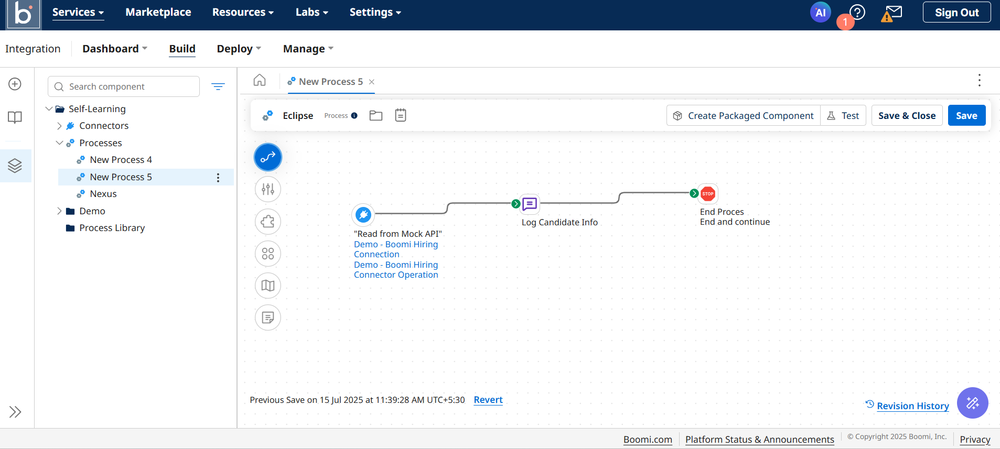

# Boomi Hiring – Log Candidate Info Process

This project is built using **Dell Boomi Free Trial** to demonstrate how to fetch applicant data using a demo connector and log their basic details like name, email, and job title.

## 🔁 Process Flow

1. **Start Step**: Begins the process
2. **Connector Call**: Reads applicant data from `Demo - Boomi Hiring`
3. **Message Step**: Logs a message with applicant details (name, email, job title)
4. **Stop Step**: Ends the process

> Display Name: `Day 2 Eclipse`

---

## 📷 Screenshots

| Process Canvas | Deployment |
|----------------|------------|
|  |  |

---

## 📄 Component XML

- Located in: [`/process/boomi-hiring-process.xml`](./process/boomi-hiring-process.xml)
- Type: `Process`
- Folder: `Self-Learning`
- Name: `New Process 5` (Recommended rename to `Boomi Hiring – Log Candidate Info`)

---

## 📥 Sample Input

This is a mock document expected from the `Boomi Hiring` API.

```json
[
  {
    "firstname": "Jane",
    "lastname": "Doe",
    "department": "Engineering",
    "openjob": "Software Engineer"
  }
]
